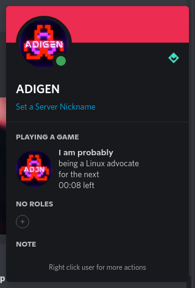
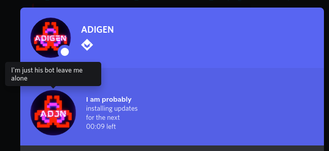

# Discord-RPC-Status

Discord-RPC-Status (or DRS for short) is a program that displays a random status message as a Rich Presence status on Discord.

## Example

|  |  |
| ------------------------------------------------------------ | ------------------------------------------------------------ |

## Installation

Requires `g++` to compile the code. Should be available by default in all (if not, most) Linux distributions.

A pre-compiled executable has also been provided (named `discord-rpc-status`)

```shell
git clone https://github.com/mradigen/discord-rpc-status.git
cd discord-rpc-status
./build
```

## Usage

In the same directory itself, run:

```shell
./run
```

The program is dynamically linked, so the library in the lib folder is required in order to run it.

## Customization

You can add/remove your status lines in/from the `statuses[]` array in the `discord-rpc-status.cpp` file. Remember to re-compile before trying to run it.

Here's an example:

```c++
char statuses[][100] = {
    "meeting new people",
    "making new friends",
    "procrastinating",
    "programming",
    "playing Minecraft",
    "looking for techies",
    "wasting time on YouTube",
    "dying",
    "installing updates",
    "having moodswings 1",
    "having moodswings 2",
    "having moodswings 3",
    "having moodswings 4",
    "having moodswings 5",
    "having moodswings 6",
    "having moodswings 7",
    "coding the next billion dollar app",
    "writing status for you to read over here",
    "time travelling",
    "looking for a better computer",
    "contemplating on why Edge exists",
    "being ADIGEN",
    "stalking you",
    "being a Linux advocate",
    "cursing about JavaScript",
};
```

## Contributing

Pull requests are welcome. For major changes, please open an issue first to discuss what you would like to change.

Please make sure to update tests as appropriate.

## License
[MIT](./LICENSE)